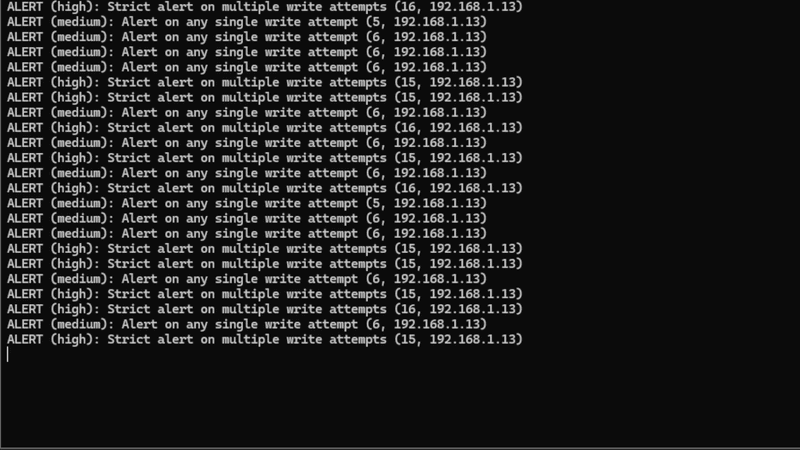

# Modbus-Guard: OT Intrusion Detection System

<p align="center">
  <!-- TODO: Record a GIF of the sniffer running alongside the fake traffic generator and place it in an 'assets' folder -->
  
</p>

Modbus-Guard is a low-latency, hybrid C/Python Intrusion Detection System (IDS) designed specifically for Operational Technology (OT) and SCADA environments. It performs Deep Packet Inspection (DPI) on Modbus-TCP traffic to identify and alert on unauthorized industrial commands in real-time.

Standard IT firewalls operate at Layer 4 (Ports/IPs) and cannot distinguish between a safe "Read" command and a dangerous "Write" command sent to a Programmable Logic Controller (PLC). Modbus-Guard bridges this gap by enforcing Layer 7 (Application) security policies.

## 🚀 Key Features

*   **High-Speed Capture:** Utilizes `libpcap` in C to monitor traffic at the network layer with minimal overhead.
*   **Deep Packet Inspection:** Deconstructs Modbus-TCP headers (MBAP) and Protocol Data Units (PDU) to extract Function Codes and Register Addresses.
*   **Dynamic Policy Engine:** A Python-based evaluation engine driven by easily readable YAML configurations.
*   **Hybrid Architecture:** Seamlessly passes parsed structs from C to Python using memory-aligned `ctypes`.
*   **Environment Agnostic:** Automatically handles varying Link-Layer offsets (Ethernet vs. Linux Cooked Capture for WSL2 compatibility).

## 🧠 Architecture

The system is decoupled to ensure performance and testability:

1.  **C-Core (The Sniffer):** Binds to the network interface, extracts IP/TCP headers, parses the Modbus payload, and formats it into a C-struct.
2.  **CTypes Bridge:** Passes the memory address of the parsed packet directly to Python, avoiding slow string-parsing or IPC.
3.  **Python Engine:** Evaluates the structured data against `rules.yaml` and triggers standard or critical alerts.

## 🛠️ Installation & Setup

### Dependencies
*   **C Compiler & Libs:** `gcc`, `make`, `libpcap-dev`
*   **Python 3:** `pyyaml`

```bash
# Ubuntu/Debian Setup
sudo apt update
sudo apt install build-essential libpcap-dev
pip3 install pyyaml
```

### Build the C Library
```bash
# Compiles src/c_core/sniffer.c into build/libsniffer.so
make
```

## 🚦 Usage

### 1. Configure Rules
Edit `config/rules.yaml` to define your authorized traffic. Example:
```yaml
rules:
  - id: "critical-register-protection"
    description: "Alert if writing to safety registers 100-105"
    function_codes: [6, 16] # Write Single/Multiple
    registers: [100, 101, 102]
    action: alert
```

### 2. Start the Guard
Requires root privileges to bind the network interface.
```bash
# Listen on a specific interface (e.g., eth0)
sudo python3 main.py -i eth0

# Listen on all interfaces (Recommended for WSL2)
sudo python3 main.py -i any
```

## 🧪 Simulation & Testing

This repository includes a full testing suite to verify the IDS without requiring physical PLC hardware.

### 1. Start the Dummy PLC
To ensure complete TCP handshakes occur, start the listener:
```bash
sudo python3 dummy_plc.py
```

### 2. Run the Traffic Generator
In a separate terminal, launch the simulator to generate a mix of "Safe" reads and "Malicious" writes:
```bash
# Ensure TARGET_IP in the script is set to your guard machine's IP or 127.0.0.1
python3 send_fake_modbus.py
```

## 🛡️ Future Enhancements
*   [ ] Implement Active Interception (IPS mode via `NFQUEUE`).
*   [ ] Add anomaly detection based on packet frequency.
*   [ ] Integrate syslog forwarding for SIEM compatibility.

---
*Developed as a demonstration of embedded network programming, memory alignment, and OT cybersecurity principles.*
